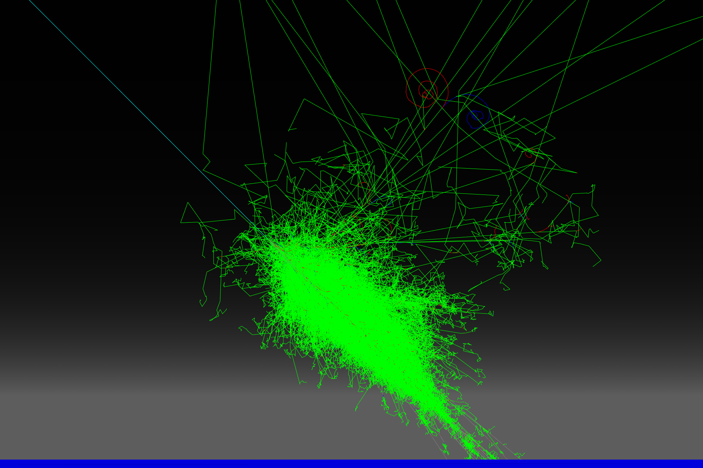

# MusAirS

Simulation of cosmic ray air shower.



## Content

- [MusAirS](#musairs)
  - [Content](#content)
  - [Quick start](#quick-start)
    - [Dependencies](#dependencies)
    - [How to build (GNU/Linux)](#how-to-build-gnulinux)
    - [How to run](#how-to-run)
      - [Interactive session](#interactive-session)
      - [Batch session](#batch-session)
  - [Coordinate convention](#coordinate-convention)
    - [Coordinate system](#coordinate-system)
    - [Angular Coordinate (in result)](#angular-coordinate-in-result)
  - [Choose an alternative physics list](#choose-an-alternative-physics-list)
  - [Run macro](#run-macro)
  - [Geometry and field](#geometry-and-field)
    - [Atmosphere modelling](#atmosphere-modelling)
      - [States](#states)
      - [Components](#components)
      - [Slicing](#slicing)
    - [Geomagnetic field](#geomagnetic-field)
    - [Elevating the ground](#elevating-the-ground)
  - [Primary particles](#primary-particles)
  - [Save primary vertex data](#save-primary-vertex-data)
  - [Who ordered neutrino?](#who-ordered-neutrino)
  - [Interpret the result](#interpret-the-result)
  - [Bug tracking](#bug-tracking)
  - [Contributing](#contributing)


## Quick start

### Dependencies

Required, built-in if not found (network or pre-downloaded source is required):

1. [Mustard (A modern, distributed offline software framework for HEP experiments)](https://github.com/zhao-shihan/Mustard) (≥ 0.1.0, built-in if not found) and its [dependencies](https://github.com/zhao-shihan/Mustard?tab=readme-ov-file#dependencies).

### How to build (GNU/Linux)

In source directory, execute line-by-line:
```sh
mkdir build
cd build
cmake ..
make -j8
```

### How to run

In build directory, look help:
```sh
./MusAirS --help
```

#### Interactive session

Run interactively:
```sh
./MusAirS
```
or
```sh
./MusAirS -i <macro_for_initialzation>
```

#### Batch session

Run in batch, sequentially:
```sh
./MusAirS <run_macro>
```
Parallel computing:
```sh
mpirun -n <nproc> ./MusAirS <run_macro>
```

## Coordinate convention

### Coordinate system

| **Coordinate** | **Direction** |
| -------------- | ------------- |
| +X             | East          |
| -X             | West          |
| +Y             | North         |
| -Y             | South         |
| +Z             | Sky           |
| -Z             | Ground        |

### Angular Coordinate (in result)

| **Coordinate** | **Expression**                     | **Direction**                                                           |
| -------------- | ---------------------------------- | ----------------------------------------------------------------------- |
| phi            | $\mathrm{atan2}(p_x, p_y)+\pi$     | $0$: North, $\frac{\pi}{2}$: East, $\pi$: South, $\frac{3\pi}{2}$: West |
| Zenith         | $1+\frac{p_z}{p}\ (=1-\cos\theta)$ | $0$: Sky, $1$: Horizon                                                  |

## Choose an alternative physics list

MusAirS uses FTFP_BERT as the default physics list. However, you may change it by option `--physics-list`. For example,
```sh
MusAirS --physics-list QBBC
```
It accepts a [Geant4 reference physics list](https://geant4-userdoc.web.cern.ch/UsersGuides/PhysicsListGuide/html/reference_PL/index.html) name as its argument.

## Run macro

We provided a few example Geant4 macros in `scripts/` directory. Based on them you can write your own.

For more, refer to the [Geant4 Book For Application Developers](https://geant4-userdoc.web.cern.ch/UsersGuides/ForApplicationDeveloper/html/index.html). [General Particle Source](https://geant4-userdoc.web.cern.ch/UsersGuides/ForApplicationDeveloper/html/GettingStarted/generalParticleSource.html) would especially be helpful.

## Geometry and field

There are some adjustable geometric and field parameters. See [the geometry description file](scripts/MusAirS.yaml) (a YAML file) for detail. The unit system is the Geant4 unit system (MeV, mm, ns).

You can adjust these parameters by importing the YAML file through macro commands. For example,
```sh
/Mustard/Detector/Description/Import another.yaml # or,
# Ixport = Export, import, and then export. This is useful for debugging.
/Mustard/Detector/Description/Ixport another.yaml
```

### Atmosphere modelling

#### States

The atmosphere is modelled by [The International Standard Atmosphere (ISA)](https://en.wikipedia.org/wiki/International_Standard_Atmosphere). It is a static atmospheric model of how the pressure, temperature and density of the Earth's atmosphere change over a range of altitudes up to 85 km above sea level. The altitude range should be enough for studying air shower up to 10 TeV.

#### Components

The components of atmosphere within the available range of ISA are almost the same as on the ground. Therefore, the air material is built based on `G4_AIR` (dry air) with different pressure, temperature and density.

#### Slicing

Geant4 does not allow basic material properties (density, pressures, etc.) to change continuously. So the atmosphere should be modelled by many slices of air with different pressures. There are 2 slicing scheme: by altitude or by pressure. The former slices the atmosphere with adjcent layers have the same thickness, while the latter slices with adjcent layers have (almost) the same pressure difference. The atmosphere top (max altitude), slicing scheme and the number of slices can be changed in the geometry description YAML file.

### Geomagnetic field

MusAirS allow user to specify a uniform magnetic field. The magnetic field vector can be set in the YAML file. It uses Geant4 unit system ($1~\mathrm{T} = 0.001~\mathrm{MeV}\cdot\mathrm{ns}/\mathrm{mm}^2 = 0.001$).

### Elevating the ground

By default, the detection plane (the ground") is at the sea level (altitude = 0 m). This can be changed in the geometry description YAML file. This allows to simulate the shower measured in a higher altitude (e.g. on a plateau). Note that the ground level should be higher than 0 m and lower than the atmosphere top.

## Primary particles

We use Geant4 [General Particle Source (GPS)](https://geant4-userdoc.web.cern.ch/UsersGuides/ForApplicationDeveloper/html/GettingStarted/generalParticleSource.html) for primary particle generation. For example, the follwing macro lines configures GPS to generate protons isotropically from 100 km above the sea level, with $E^{-2.7}$ energy spectrum ranges from 2 GeV to 10 TeV.
```sh
/gps/particle         proton
/gps/position         0 0 100 km
/gps/ang/type         iso
/gps/ene/type         Pow
/gps/ene/biasAlpha    -2.7
/gps/ene/min          2 GeV
/gps/ene/max          10 TeV
```
Detailed usage can be found in the [Geant4 Book For Application Developers](https://geant4-userdoc.web.cern.ch/UsersGuides/ForApplicationDeveloper/html/GettingStarted/generalParticleSource.html).

## Save primary vertex data

Primary vertices are not recorded by default. You can enable saving primary vertices by the command
```sh
/MusAirS/Analysis/SavePrimaryVertexData yes
```
This can sometimes be useful in debugging.

## Who ordered neutrino?

Neutrino hits are not recorded by default (since there are to much neutrino). You can let `EarthSD` to record neutrino hits by the command
```sh
/MusAirS/SD/EarthSD/DetectNeutrino yes
```

## Interpret the result

// TODO

## Bug tracking

Open an issue if you found any defects or bugs.

## Contributing

Open a pull request whenever you want.
