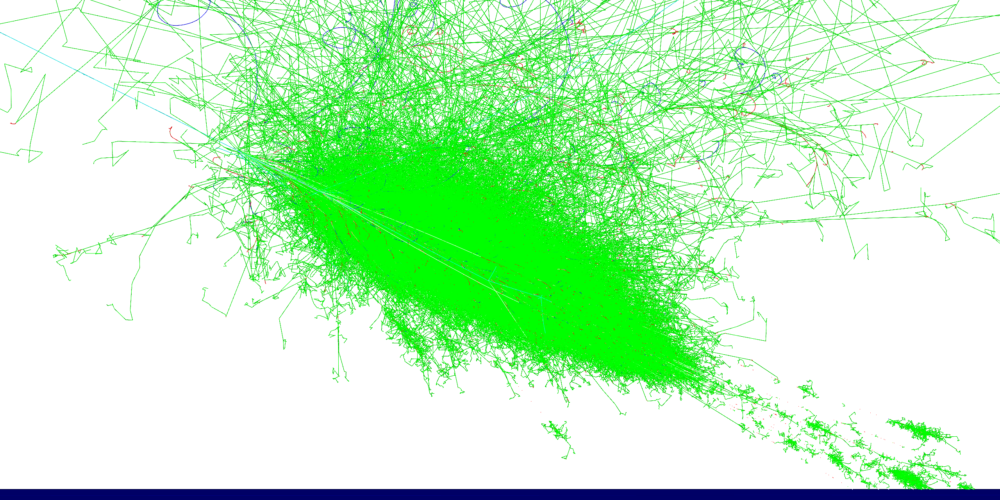

# MusAirS

Simulation of cosmic ray air shower.



## Quick start

### Dependencies

Required, built-in if not found (network or pre-downloaded source is required):

1. [Mustard (A modern, distributed offline software framework for HEP experiments)](https://github.com/zhao-shihan/Mustard) (≥ 0.1.0, built-in if not found) and its [dependencies](https://github.com/zhao-shihan/Mustard?tab=readme-ov-file#dependencies).

### How to build (GNU/Linux)

In source directory, execute line-by-line:
```sh
mkdir build
cd build
cmake ..
make -j8
```

### How to run

In build directory, look help:
```sh
./MusAirS --help
```

#### Interactive session

Run interactively:
```sh
./MusAirS
```
or
```sh
./MusAirS -i <macro_for_initialzation>
```

#### Batch session

Run in batch, sequentially:
```sh
./MusAirS <run_macro>
```
Parallel computing:
```sh
mpirun -n <nproc> ./MusAirS <run_macro>
```

## Choose an alternative physics list

MusAirS uses FTFP_BERT as the default physics list. However, you may change it by option `--physics-list`. For example,
```sh
MusAirS --physics-list QBBC
```
It accepts a [Geant4 reference physics list](https://geant4-userdoc.web.cern.ch/UsersGuides/PhysicsListGuide/html/reference_PL/index.html) name as argument.

## Run macro

We provided a few example Geant4 macros, based on which you can write your own.

For more, refer to [Geant4 Book For Application Developers](https://geant4-userdoc.web.cern.ch/UsersGuides/ForApplicationDeveloper/html/index.html). [General particle source](https://geant4-userdoc.web.cern.ch/UsersGuides/ForApplicationDeveloper/html/GettingStarted/generalParticleSource.html) would especially be helpful.

## Geometry and field

There are some adjustable geometric and field parameters. See [the geometry description file](scripts/MusAirS.yaml) for detail. The unit system is the Geant4 unit system (MeV, mm, ns).
